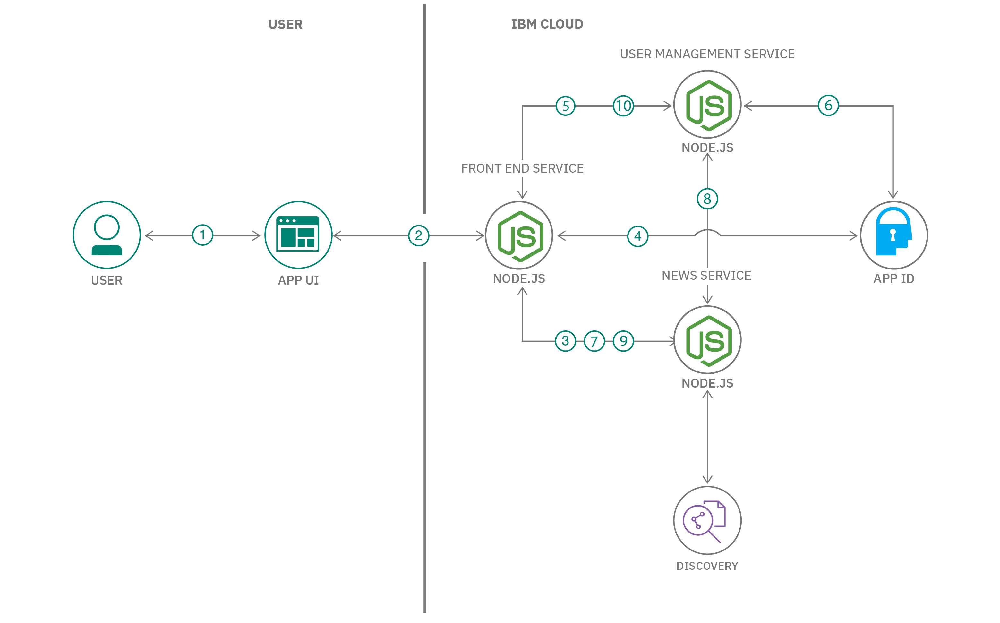
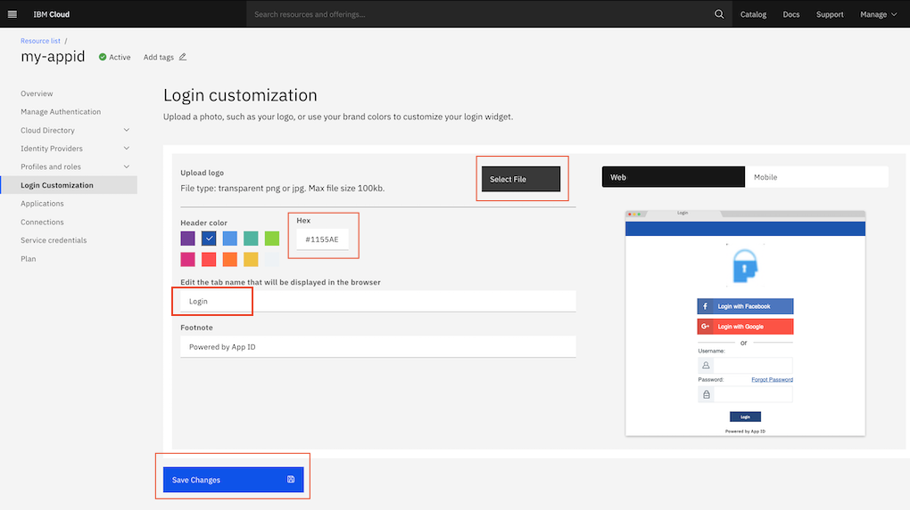

# Add Security and User Personalization for an online Finance news portal using AppID

There are two important aspects for any application that you build - `Authentication and User Personalization`. 

If you take authentication on online platforms, the support for `Social login` is common now. The users can login to the online portal using their Google or Facebook accounts. This method of authentication is beneficial both for online portals and end users. There is no need to create a separate account on every online portal for end-users. This leads to increased consumption for online portals. The trust in the security provided by social media login has been increasing too. 

The second aspect is user personalization. Many online portals have vast amount of information. The end user is interested only in certain areas of the information. User personalization can make the portal more consumable for an end user. Let us take the example of a online news portal. The news can be from the area of Politics, Entertainment, Science, Technology, Sports or Finance. An end user who is interested in Sports will have to filter through many articles before reading the article of interest. Here, user personalization can do the filtering task and present articles in the end users areas of interest.

In this code pattern, you will build an online financial news portal with social login and user personalization with AppID. The news portal will source articles from `Discovery News` collection. The end user can log in using their existing Google or Facebook accounts. After login, the user builds a profile specifying the areas of interest like Equity, Mutual Funds etc. The application filters the news content based on user profile and presents it to the end user for consumption.

When the reader has completed this Code Pattern, they will understand how to:
* Add social login to an application with AppID
* Build user profile with AppID
* Get financial news from discovery news collection using Discovery query language
* Add user personalization to filter news articles based on user profile

## Flow



1. User accesses the `App UI` rendered by the `Front-End` service
2. The `App UI` sends the request to the `Front-End` service
3. The `Front-End` service fetches the finance news from `News` service. The `News` service sources the news from `Watson Discovery News` which is displayed on the `App UI`
4. User logins to the portal through the `Front-end` service using social sign-in powered by App ID
5. User sets preferences through the `Front-end` service which invokes the `User management` service with the preferences
6. The `User management` service then sets the user profile on App ID  
7. After sign-in, the `Front-End` service invokes the `News` service for finance news 
8. The `News` service retrieves the user's profile and preferences 
9. The `News` service returns personalized news sourced from `Watson Discovery News` based on the user's profile
10. User can update his preferences and then application shows personalized news based on the new preferences 

## Pre-requisites

* [IBM Cloud account](http://cloud.ibm.com/): Create an IBM Cloud account.
* [Install ibmcloud CLI](https://cloud.ibm.com/docs/cli?topic=cli-install-ibmcloud-cli)
* [OpenShift Cluster](https://docs.openshift.com): You should have one OpenShift cluster, if you want to deploy your application on OpenShift.
* [Install oc CLI](https://cloud.ibm.com/docs/openshift?topic=openshift-openshift-cli#cli_oc)

# Steps

Please follow the below to setup and run this code pattern.

 1. [Get the code](#1-get-the-code)  
 2. [Create IBM Cloud Services](#2-create-ibm-cloud-services) 
 3. [Configure App ID](#3-configure-app-id)
 4. [Deploy Application](#4-deploy-application)  
    4.1 [Deploy on Cloud Foundry](#41-deploy-on-cloud-foundry)  
    4.2 [Deploy on OpenShift](#42-deploy-on-openshift)
 5. [Access your application and analyze the results](#5-access-your-application-and-analyze-the-results)  

### 1. Get the code

Clone the repository using the below command.

```
git clone https://github.com/IBM/secure-and-personalize-your-app-using-appid.git
```

### 2. Create IBM Cloud Services

#### 2.1 Create Discovery Service

You can create the service by either using the IBM Cloud console([Section 2.11](https://github.com/IBM/secure-and-personalize-your-app-using-appid#211-create-from-the-ibm-cloud-console)) or the IBM Cloud CLI([Section 2.12](https://github.com/IBM/secure-and-personalize-your-app-using-appid#212-create-using-ibm-cloud-cli)).

##### 2.11 Create from the IBM Cloud Console

Login to [IBM Cloud](https://cloud.ibm.com) . 

Click on `Catalog` in top menu bar. Under `IBM Cloud products` search for `Discovery`. Click on `Discovery` tile that gets listed.

Select `Lite` plan, if not already selected, then click `Create` to create an instance of Watson Discovery service. When Discovery instance is created in a minute or two, store `Service credentials` in a text file. Please make a note of the `apikey` and `url`. This will be required later to configure the application.


##### 2.12 Create using IBM Cloud CLI

Skip this section if you already created the `Discovery` service from IBM Cloud console as described in the previous section. 

Run the below commands to create the `Discovery` service:

```
ibmcloud login [--sso]
ibmcloud resource service-instance-create my-discovery discovery lite [region]
```
> Note: Replace the placeholder for region(e.g: us-east) before running the command. Also, note the GUID of the service. It will be required in the next step.

Run the below command to create a service key:

```
ibmcloud resource service-key-create skey --instance-id [GUID of Discovery]
```
> Note: Replace the placeholder for GUID noted earlier before running the command.

The output from the command will contain the credentials as shown below. Please make a note of the `apikey` and `url`. This will be required later to configure the application.

```
Name:          skey   
ID:            crn:v1:bluemix:public:discovery:us-east:a/96xxxx82:resource-key:38xxxxb5   
Created At:    Tue Jan  5 06:09:04 UTC 2021   
State:         active   
Credentials:                                   
               apikey:                   WtxxxxtT      
               iam_apikey_description:   Auto-generated for key 38xxxxb5      
               iam_apikey_name:          skey      
               iam_role_crn:             crn:v1:bluemix:public:iam::::serviceRole:Writer      
               iam_serviceid_crn:        crn:v1:bluemix:public:iam-identity::a/96xxxxa6::serviceid:ServiceId-2cxxxx7a      
               url:                      https://api.us-east.discovery.watson.cloud.ibm.com/instances/2axxxx82    

```


#### 2.2 Create App ID service instance

You can create the service by either using the IBM Cloud console([Section 2.21](https://github.com/IBM/secure-and-personalize-your-app-using-appid#221-create-from-the-ibm-cloud-console)) or the IBM Cloud CLI([Section 2.22](https://github.com/IBM/secure-and-personalize-your-app-using-appid#222-create-using-ibm-cloud-cli)).

##### 2.21 Create from the IBM Cloud Console

Login to [IBM Cloud](https://cloud.ibm.com). 

Click on `Catalog` in top menu bar. Under `IBM Cloud products` search for `App ID`. Click on `App ID` tile that gets listed.

Select `Lite` plan, if not already selected, then click `Create` to create an instance of App ID. When App ID instance is created, make a note of service credentials. If service credentials are not available by default, you can create new credentials as shown.


Store `Service credentials` in a text file. Please make a note of the `tenantId`, `secret` `profilesUrl`, `oauthServerUrl` and `clientId`. This will be required later to configure the application.

##### 2.22 Create using IBM Cloud CLI

Skip this section if you already created the `App ID` service from IBM Cloud console as described in the previous section. 

Run the below commands to create the `App ID` service:
```
ibmcloud resource service-instance-create my-appid appid lite [region]
```
> Note: Replace the placeholder for region(e.g: us-east) before running the command. Also, note the GUID of the service. It will be required in the next step.

Run the below command to create a service key:

```
ibmcloud resource service-key-create skey --instance-id [GUID of App ID]
```
> Note: Replace the placeholder for GUID noted earlier before running the command.

The output from the command will contain the credentials as shown below.  Please make a note of the `tenantId`, `secret` `profilesUrl`, `oauthServerUrl` and `clientId`. This will be required later to configure the application.

```
Name:          skey   
ID:            crn:v1:bluemix:public:appid:us-east:a/96xxxx73:resource-key:65xxxx9d   
Created At:    Tue Jan  5 04:45:41 UTC 2021   
State:         active   
Credentials:                                   
              apikey:                   dBxxxx7k      
              appidServiceEndpoint:     https://us-east.appid.cloud.ibm.com      
              clientId:                 65xxxx9d      
              discoveryEndpoint:        https://us-east.appid.cloud.ibm.com/oauth/v4/3cxxxx73/.well-known/openid-configuration      
              iam_apikey_description:   Auto-generated for key 65xxxx9d      
              iam_apikey_name:          skey      
              iam_role_crn:             crn:v1:bluemix:public:iam::::serviceRole:Writer      
              iam_serviceid_crn:        crn:v1:bluemix:public:iam-identity::a/96xxxxa6::serviceid:ServiceId-a0xxxx00      
              managementUrl:            https://us-east.appid.cloud.ibm.com/management/v4/3cxxxx73      
              oauthServerUrl:           https://us-east.appid.cloud.ibm.com/oauth/v4/3cxxxx73      
              profilesUrl:              https://us-east.appid.cloud.ibm.com      
              secret:                   OTxxxxYx      
              tenantId:                 3cxxxx73      
              version:                  4      
```


### 3. Configure App ID

Access the App ID service instance using IBM Cloud dashboard. Select `Manage Authentication` in left panel menu. It shows the list of `Identity Providers`. We are using social sign-in using Facebook and Google only in this code pattern, hence disable other identity providers except Facebook and Google. The changes will get saved automatically.


Next, go to `Login Customization` in left panel menu. Using this you can customize your login page.



***Upload Logo***. You can choose any image of your choice as a logo of your login page. In this code pattern, App ID logo itself is being used and provided for your ease in `images` folder of the repository.

***Header Color***. You can choose any color for the header or provide hex code of the color directly. For example, give hex color code as #181818 for black color header.

***Tab Name***. You can add any name as tab name of your choice.

Once done, click on `Save Changes`.


### 4. Deploy Application

The application can be deployed on a IBM Cloud Foundry runtime or OpenShift cluster on IBM Cloud.

Please refer [Section 4.1](https://github.com/IBM/secure-and-personalize-your-app-using-appid#41-deploy-on-cloud-foundry) to deploy the application on Cloud Foundry.

Please refer [Section 4.2](https://github.com/IBM/secure-and-personalize-your-app-using-appid#42-deploy-on-openshift) to deploy the application on OpenShift.

  ### 4.1 Deploy on Cloud Foundry

  Login to IBM Cloud using the following command.

  ```
    ibmcloud login [--sso]
  ```

 #### 4.1.1 Configure and deploy user management service on Cloud Foundry

   ##### 4.1.1.1 Configure
    
   The `User management` service needs to be configured to access the `App ID` service to store and access user profiles.
   
   Run the below commands to create the environment file:
   
    $ cd user-management-service
    $ cp .env.sample .env

   Now, edit the environment file(.env) and update with appropriate values(as shown below) that you noted earlier during creation of `App ID` service.
   
   ```
   OAUTH_SERVER_URL=https://us-east.appid.cloud.ibm.com/oauth/v4/3cxxxx73
   TENANT_ID=3cxxxx73
   PROFILES_URL=https://us-east.appid.cloud.ibm.com                                                    
   ```

   ##### 4.1.1.2 Deploy 

   Run the below command in the `user-management-service` folder to deploy the service:

    $ ibmcloud cf push <name>
   
   >Note: Replace the place holder for [name] with a name(e.g. user-management-service) for the service. 
 
   Run the below command to get the deployed application URL:
   
    $ ibmcloud cf apps

   Make a note of this URL. This is needed to configure the other services.

   #### 4.1.2 Configure and deploy news service on Cloud Foundry

   ##### 4.1.2.1 Configure

   The `News` service needs to be confgured to access the `Discovery` service and the `User management` service.
   
   Run the below commands to create the environment file:
   
    $ cd news-api-service
    $ cp .env.sample .env

   Now, edit the environment file(.env) and update with appropriate values(as shown below) from the credentials data noted during creation of `Discovery` service, and the `User management` service url.
   
   ```
   DISCOVERY_IAM_URL=https://iam.bluemix.net/identity/token
   DISCOVERY_IAM_APIKEY=WtxxxxtT
   DISCOVERY_URL=https://api.us-east.discovery.watson.cloud.ibm.com/instances/2axxxx82
   ENVIRONMENT_ID=system
   COLLECTION_ID=news-en
   DISCOVERY_API_VERSION=2019-02-28
   USER_MGMT_SERVICE_URL=http://user-management-service-xxxx.mybluemix.net/user-preferences                                                                                                       
   ```

   ##### 4.1.2.2 Deploy

   Run the below command in the `news-api-service` folder to deploy the service:

    $ ibmcloud cf push <name>
    
   >Note: Replace the place holder for [name] with a name(e.g news-service) for the service. 
    
   Run the below command to get the deployed application URL:
      
    $ ibmcloud cf apps

   Make a note of this URL. This is needed to configure the other services.

   #### 4.1.3 Configure and deploy front end service on Cloud Foundry

   ##### 4.1.3.1 Configure

   The `Front end` service needs to be configured to access the `App ID` service, `User management` service and `News` service.
   
   Run the below commands to create the environment file:
   
    $ cd front-end-service
    $ cp .env.sample .env

   Edit the environment file(.env) and update with appropriate values(as shown below) of App ID credentials, and URLs of `User management` and `News` services.
   
   ```
// APP ID callback URL
CALLBACK_URL = "/callback"

//Backend Services URL
NEWS_SERVICE_URL = "http://news-service-xxxx.mybluemix.net/generic-news"
PERSONALISED_NEWS_URL = "http://news-service-xxxx.mybluemix.net/personalized-news"
USER_MGMT_SERVICE_URL = "http://user-management-service-xxxx.mybluemix.net/user-preferences"
CHECK_USER_PREFERENCES_URL = "http://user-management-service-xxxx.mybluemix.net/is-user-preferences-set"

//APP ID Credentials
TENANT_ID = "3cxxxx73"
CLIENT_ID = "65xxxx9d"
SECRET = "OTxxxxYx"
OAUTH_SERVER_URL = "https://us-east.appid.cloud.ibm.com/oauth/v4/3cxxxx73"
PROFILES_URL = "https://us-east.appid.cloud.ibm.com"
   ```

   ##### 4.1.3.2 Deploy service

   Navigate to the directory `front-end-service`.

    $ cd front-end-service
    $ ibmcloud cf push <name>
    
    ## Get your application URL
    $ ibmcloud cf apps
  
   >Note: Replace the place holder for [name] with a name(e.g front-end-service) for the service. 
   Make a note of this Front End Service application URL. This is needed in next step.

   ##### 4.1.3.3 Update Callback URL in App ID

   Go to `IBM Cloud dashboard -> Services -> <your AppID service> -> Manage Authentication`.

   

   Select `Authentication Settings` and in `Add web redirect URLs` section, add the following URL.

   ```
   https://<front-end-service-application-url>/callback
   ```
   >Note: Replace the placeholder [front-end-service-application-url]  with the `Front end` service URL noted earlier.
   
   Now you are all set to access your application using the `Front end` service URL.


  ### 4.2 Deploy on OpenShift

   Login to OpenShift. From the IBM Cloud console go to `Clusters > Your OpenShift Cluster > OpenShift web console`. From the OpenShift web console click the menu in the upper right corner (the label contains your email address), and select Copy Login Command. Click on Display token and paste the command into a terminal session. For example:
  ```
  oc login --token=xxxx --server=https://xxxx.containers.cloud.ibm.com:xxx
  ```

   #### 4.2.1 Configure and deploy user management service on OpenShift

   ##### 4.2.1.1 Configure 

   Please refer to [Section 4.1.1.1](https://github.com/IBM/secure-and-personalize-your-app-using-appid#4111-configure) to configure the service.
   
   ##### 4.2.1.2 Deploy 

   Run the below commands in the `user-management-service` folder to deploy the service:

    $ cd user-management-service
    $ oc new-app --name=<app-name> .
    $ oc start-build <app-name> --from-dir=.
    
    ## build status can be checked using following command
    $ oc logs -f bc/<app-name>
    
    ## app deployment status can be checked using below command
    $ oc status        # it should show that 1 pod is deployed for your app
    
    $ oc expose svc/<app-name>
    $ oc get routes <app-name>  ## copy full route for next step

   >Note: Replace the placeholder [app-name] with a name(e.g: user-mgmt-service) for your service.
   
   Make a note of this User Management Service application URL. This is needed in below steps.

  #### 4.2.2 Deploy news service on OpenShift

  ##### 4.2.2.1 Configure

  Please refer to [Section 4.1.2.1](https://github.com/IBM/secure-and-personalize-your-app-using-appid/4121-configure) to configure the service.

  ##### 4.2.2.2 Deploy

   Run the below commands in the `news-api-service` folder to deploy the service:

    $ cd news-api-service
    $ oc new-app --name=<app-name> .
    $ oc start-build <app-name> --from-dir=.
    
    ## build status can be checked using following command
    $ oc logs -f bc/<app-name>
    
    ## app deployment status can be checked using below command
    $ oc status        # it should show that 1 pod is deployed for your app
    
    $ oc expose svc/<app-name>
    $ oc get routes <app-name>  ## copy full route for next step

   >Note: Replace the placeholder [app-name] with a name(e.g: news-service) for your service.
   Make a note of the service URL. This is needed to configure the other services.

   #### 4.2.3 Deploy front-end service on OpenShift

   ##### 4.2.3.1 Configure

   Please refer to [Section 4.1.3.1](https://github.com/IBM/secure-and-personalize-your-app-using-appid#4131-configure) to configure the service.
    
   ##### 4.2.3.2 Deploy 

   Run the below commands in the `front-end-service` folder to deploy the service:

    $ cd front-end-service
    $ oc new-app --name=<app-name> .
    $ oc start-build <app-name> --from-dir=.
    
    ## build status can be checked using following command
    $ oc logs -f bc/<app-name>
    
    ## app deployment status can be checked using below command
    $ oc status        # it should show that 1 pod is deployed for your app
    
    $ oc expose svc/<app-name>
    $ oc get routes <app-name>  ## copy full route for next step
    
    # this route will be used by AppID for callback URL, so lets update deployment config before accessing the application
    $ oc set env dc/<your-app-name> APPLICATION_URL=http://<your-application-route>

   >Note: Replace the placeholder [app-name] with a name(e.g: front-end-service) for your service.
   
   Make a note of the service URL. This is needed in next step.

   ##### 4.2.3.3 Update Callback URL in App ID

   Go to `IBM Cloud dashboard -> Services -> <your AppID service> -> Manage Authentication`. 

   

   Select `Authentication Settings` and in `Add web redirect URLs` section, add the following URL.

   ```
   http://<your-application-route>/callback
   ```

   Now you are all set to access your application.

> Note: Hybrid mode of deployment (some services on Cloud foundry and some on OpenShift) is also possible. You can choose the deployment strategy as per your requirement. 

### 5. Access your application and analyze the results

You can access the deployed application with the front end service URL on any browser. You can explore the application as shown in the below video.


In this application, 
* The generic `News` service returns top 10 finance news of the last three days. This configuration can be changed in `News` service.
* This application uses only Facebook and Google sign-in. The other ways of authentication can also be explored in App ID and used as per the requirement.
* From the user's social media profile, this application uses user's name only. There are other attributes which can be used for personalization in the application. The user's email id can be used for email notification in the application. You may use user's photo as well retrieved from Facebook profile.
* The personalized `News` service returns top 10 finance news of the last seven days. This is configured in the `News` service.

## Learn More

* [Explore AppID](https://cloud.ibm.com/docs/appid)
* [Learn more about IBM Cloud Security Services](https://cloud.ibm.com/catalog?category=security#services)
* [Build Nodejs Services with AppID](https://cloud.ibm.com/docs/appid?topic=appid-web-node)

## License

This code pattern is licensed under the Apache Software License, Version 2. Separate third-party code objects invoked within this code pattern are licensed by their respective providers pursuant to their own separate licenses. Contributions are subject to the [Developer Certificate of Origin, Version 1.1 (DCO)](https://developercertificate.org/) and the [Apache Software License, Version 2](https://www.apache.org/licenses/LICENSE-2.0.txt).

[Apache Software License (ASL) FAQ](https://www.apache.org/foundation/license-faq.html#WhatDoesItMEAN)
